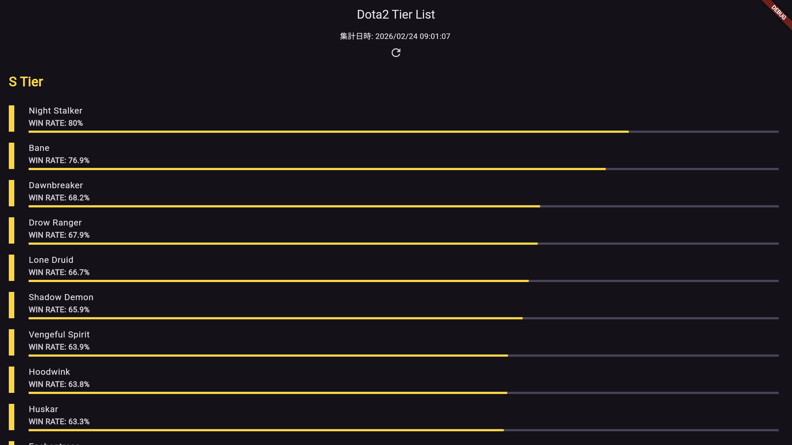

# Dota2 Tier List Web App



## 1. プロジェクト概要
Dota2の全ヒーローの勝率をバックエンドで自動集計し、サーバーレスAPIを通じてFlutter Webでティアリストとして視覚化するフルスタックアプリケーションです。

## 2. システムアーキテクチャ

- **Worker:** Spring Boot (Java 21)  
  定期的なデータスクレイピングとDynamoDBへの保存。

- **Infrastructure:** AWS CDK (TypeScript)  
  EC2/ASG、Lambda、API Gateway、DynamoDBのIaC管理。定期的な集計はASGのスケージュールスケーリングを使用。

- **API:** AWS Lambda + API Gateway  
  Zodによる型安全なデータ提供。

- **Frontend:** Flutter Web (Dart)  
  Riverpod × Freezed によるクリーンアーキテクチャ実装。

## 3. 技術的な挑戦と解決策

- **DynamoDBの型マッピング最適化**  
  Javaの命名規則とDynamoDB Enhanced Clientの挙動を深く理解し、属性マッピングの不一致を解消。

- **サーバーレスにおけるCORSの実装**  
  Lambdaプロキシ応答におけるヘッダー付与の必要性を学び、安全なクロスオリジン通信を実現。

## 4. ディレクトリ構成
```
├── spring-boot-worker/ # Worker (Java)
├── infra/ # AWS CDK + Lambda (TypeScript)
└── frontend/ # Flutter Web App (Dart)
```
